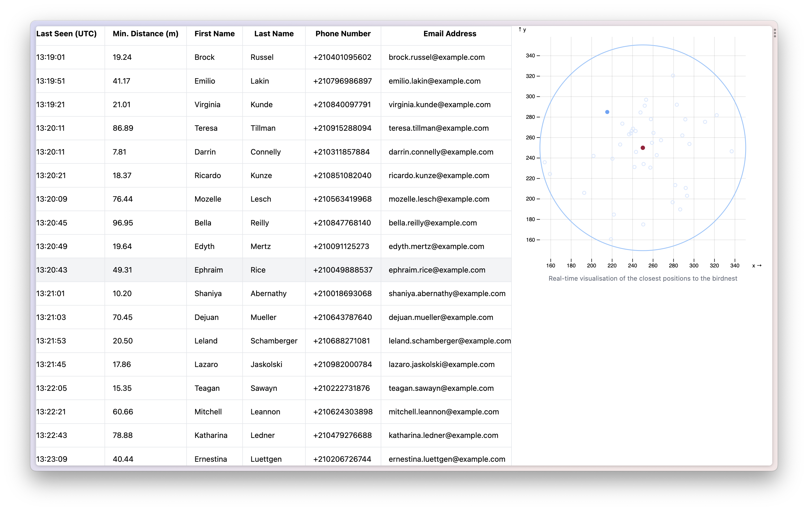
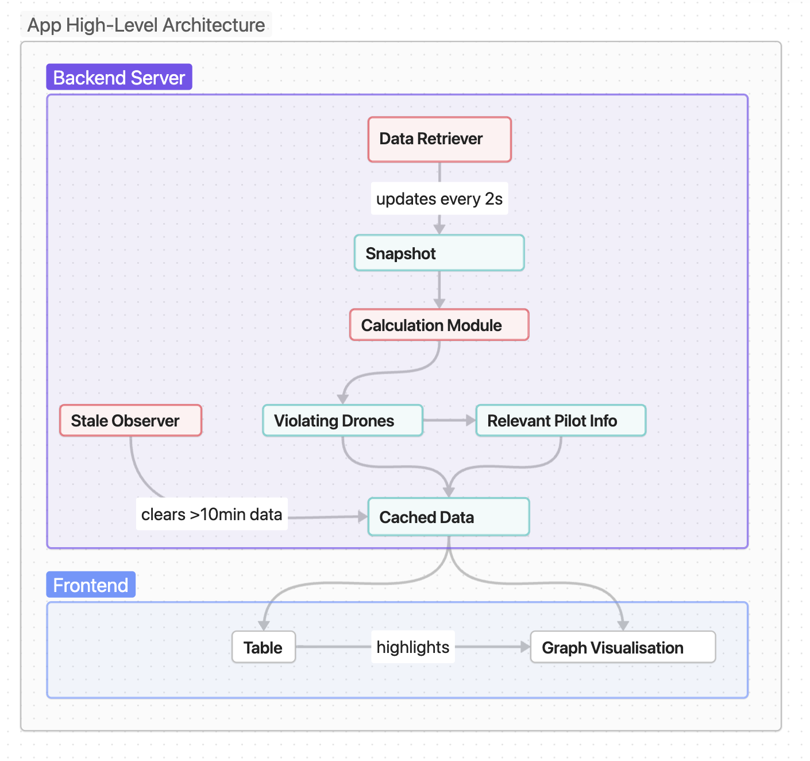

This repository contains my solution for the [Birdnest Assignment](https://assignments.reaktor.com/birdnest/). The web application lists and visualises all the pilots who recently violated the No-Drone-Zone (NDZ) perimeter.

- [App Architecture](#app-architecture)
- [Notes on Objectives](#notes-on-objectives)
- [Notes on Backend](#notes-on-backend)
- [Notes on Frontend](#notes-on-frontend)
- [Technologies](#technologies)
- [Deployment](#deployment)
- [Installation and Local Setup](#installation-and-local-setup)


## App Architecture

The web application consists of a backend server, and a frontend app. The backend is responsible for caching the data, the frontend visualises it.



The architecture is kept fairly simplistic; more sophisticated architectural patterns such as the MVC are not needed as the user does not manipulate the view or the data.

## Notes on Objectives
We persist the pilot information for **10 minutes** since their drone was last seen by the equipment, not since the pilot last violated the NDZ.

**Scalability:** the current approach (caching data in memory on the backend server) works well with the amount of data at hand but would not be able to handle large amounts of data. To scale this application, a first idea would be to turn the server into a pipeline which accumulates the cached data in a hosted database instance. The frontend could fetch the data from there and handle potential pagination challenges.

## Notes on Backend
The backend exposes a single endpoint, for retrieving the cached data of violating drones and pilots. The data is presented in JSON.

```
GET birdnest.herokuapp.com/violating-pilots
```

To build the cache on the server, I considered these desirable actions:
- Remove drones by time > 10min
- Update pilot time if it is seen again by the equipment
- Keep track of min distance, potentially update

Hence, the following data structure was used:

```js
// droneDict
key: serial number
value:
	last_seen
	min_dist_to_nest
	// optional but usable for visualisation
	min_position_x
	min_position_y
	first_name
	last_name
	// ... further pilot information
```

This schema requires to check for every entry that `last_seen < 10min` , for every single pilot, at a regular interval. Iterating over every entry is expensive (might be doable for this amount of data but still not ideal), so an additional data structure was used to circumvent this:

```js
// timeDict
key: last_seen
value: [
	// list of serial numbers with same value as last_seen
]
```

This enables the removal of the stalest data in the `droneDict` by popping the stalest `last_seen` key if it passes the `10min` threshold.

The caching process is scheduled to run every `1s`. The Birdnest specification states that the snapshot updates **about every 2s**. The 'about' was concerning to me, the 1s interval ensures that the cache always contains the latest data and does not miss out on a snapshot.

## Notes on Frontend
The frontend uses the [useSWR()](https://swr.vercel.app/) hook, with a 1s revalidation interval, to fetch data and keep the table up-to-date with the cache.

## Technologies
The backend is implemented using JavaScript. We use [express](https://expressjs.com/) to run a server in a nodejs environment.

The frontend is implemented using TypeScript and [nextjs](https://nextjs.org/). For styling, [tailwindcss](https://tailwindcss.com/) was used. The visualisation is powered by [d3js](https://d3js.org/).

## Deployment
The backend is deployed at [birdnest.herokuapp.com/violating-pilots](https://birdnest.herokuapp.com/violating-pilots). The frontend is deployed at [birdnest-assignment.vercel.app/](https://birdnest-assignment.vercel.app/).

They are deployed at two different hosting providers as Heroku provides the functionality for continuously caching data 24/7, which Vercel is lacking as far as I know. For the frontend, I prefer the continuous deployment experience with Vercel.

## Installation and Local Setup
1. `cd` into the respective server or frontend folder of this repository.
2. Run `yarn` to install the necessary node modules.
3. Run `yarn run dev` (frontend) or `node index.js` (backend).